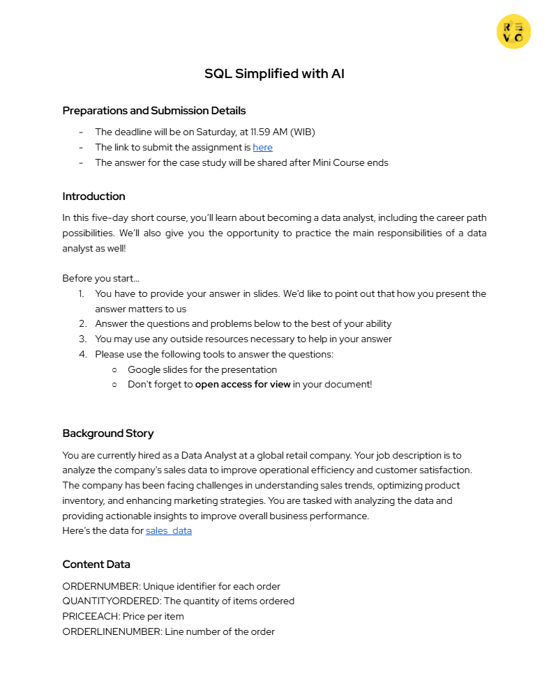
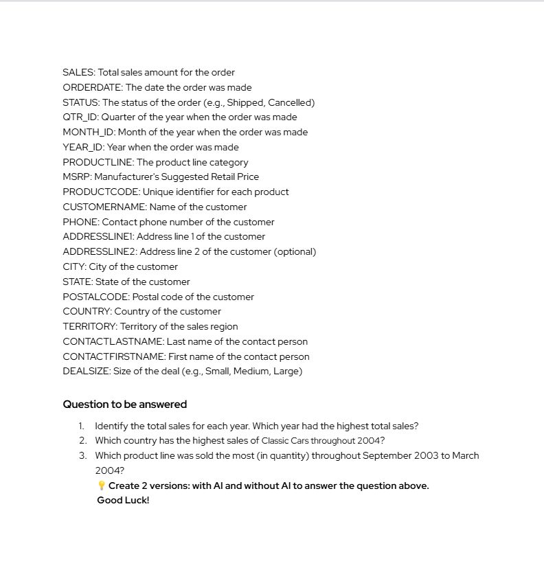

# Analisis Penjualan Global Retail

# Teknologi


## Deskripsi Proyek

Proyek ini merupakan studi kasus analisis data penjualan sebuah perusahaan retail global. Sebagai seorang Data Analyst, tujuan utama proyek ini adalah menganalisis data transaksi penjualan untuk mengidentifikasi tren penjualan, pasar dengan performa terbaik, serta kategori produk yang paling diminati guna mendukung pengambilan keputusan bisnis.

Analisis dilakukan menggunakan Python dengan pendekatan Data Analytics Workflow yang meliputi Data Understanding, Data Cleaning, Exploratory Data Analysis (EDA), Business Insight, dan Business Recommendation.

---

# Latar Belakang

Perusahaan retail global mengalami beberapa tantangan dalam mengelola performa bisnis, antara lain:

- Sulit memahami tren penjualan dari waktu ke waktu.
- Belum mengetahui negara dengan performa penjualan terbaik.
- Kesulitan menentukan kategori produk yang paling diminati pelanggan.
- Membutuhkan insight berbasis data untuk mendukung strategi pemasaran dan pengelolaan inventori.

Sebagai Data Analyst, tugas yang diberikan adalah melakukan analisis terhadap data penjualan dan menghasilkan insight yang dapat digunakan sebagai dasar pengambilan keputusan.

---

# Tujuan Analisis

Analisis ini bertujuan untuk:

- Mengidentifikasi total penjualan pada setiap tahun.
- Menentukan tahun dengan total penjualan tertinggi.
- Mengetahui negara dengan penjualan Classic Cars terbesar selama tahun 2004.
- Mengidentifikasi Product Line dengan jumlah penjualan (Quantity) terbanyak pada periode September 2003 hingga Maret 2004.
- Memberikan insight dan rekomendasi bisnis berdasarkan hasil analisis.

---

# Business Questions

Analisis difokuskan untuk menjawab tiga pertanyaan berikut:

1. Berapa total penjualan pada setiap tahun? Tahun mana yang memiliki total penjualan tertinggi?

2. Negara mana yang memiliki penjualan terbesar untuk kategori Classic Cars selama tahun 2004?

3. Product Line apa yang memiliki jumlah penjualan (Quantity Ordered) tertinggi selama periode September 2003 hingga Maret 2004?

---

# Dataset

Dataset berisi data transaksi penjualan perusahaan retail dengan informasi sebagai berikut:

### Informasi Transaksi

- ORDERNUMBER
- ORDERDATE
- STATUS
- SALES
- QUANTITYORDERED

### Informasi Produk

- PRODUCTCODE
- PRODUCTLINE
- MSRP
- PRICEEACH

### Informasi Pelanggan

- CUSTOMERNAME
- COUNTRY
- CITY
- STATE
- TERRITORY

### Informasi Waktu

- YEAR_ID
- MONTH_ID
- QTR_ID

---

# Tools yang Digunakan

- Python
- Pandas
- NumPy
- Matplotlib
- Plotly
- Jupyter Notebook / Google Colab
- Google Slides

---

# Metodologi Analisis

Proyek ini mengikuti tahapan analisis data sebagai berikut:

1. Business Understanding
2. Data Understanding
3. Data Cleaning
4. Exploratory Data Analysis (EDA)
5. Business Question Analysis
6. Business Insight
7. Business Recommendation
8. Presentation

---

# Struktur Proyek

```
Global-Retail-Sales-Analysis/
│
├── data/
│   └── sales_data.csv
│
├── notebook/
│   └── sales_analysis.ipynb
│
├── output/
│   ├── figures/
│   └── tables/
│
├── slides/
│   └── presentation.pdf
│
├── README.md
│
└── requirements.txt
```

---

# Tahapan Analisis

## 1. Data Understanding

Melakukan eksplorasi awal terhadap dataset meliputi:

- Jumlah data
- Jumlah variabel
- Tipe data
- Missing Values
- Duplicate Data
- Statistik deskriptif

---

## 2. Data Cleaning

Membersihkan data agar siap dianalisis.

Tahapan meliputi:

- Menghapus duplicate
- Menangani missing value
- Memperbaiki tipe data
- Validasi kualitas data

---

## 3. Exploratory Data Analysis (EDA)

Melakukan eksplorasi data menggunakan visualisasi untuk memahami pola penjualan berdasarkan:

- Tahun
- Negara
- Product Line
- Quantity Ordered
- Sales

---

## 4. Business Analysis

Menjawab seluruh Business Questions berdasarkan hasil analisis data.

---

## 5. Business Insight

Menginterpretasikan hasil analisis menjadi insight yang mudah dipahami oleh stakeholder.

---

## 6. Business Recommendation

Memberikan rekomendasi strategis berdasarkan insight yang diperoleh.

---

# Output Proyek

Output yang dihasilkan pada proyek ini meliputi:

- Notebook Analisis Data
- Visualisasi Data
- Business Insight
- Business Recommendation
- Presentasi Analisis

---

# Hasil Analisis

Bagian ini akan diisi setelah proses analisis selesai dilakukan.

---

# Insight Bisnis

Bagian ini akan diisi berdasarkan hasil analisis.

---

# Rekomendasi

Bagian ini akan berisi rekomendasi strategis yang dihasilkan dari analisis.

---

# Tugas Mini Course Data Analytics Revo U

Berikut adalah tugas yang diberikan dalam program Data Analyst Bootcamp:

<div align="center">
  
  <br/>
  <em>Gambar 1: Soal Tugas Analisis Penjualan Global Retail</em>
</div>

<br/>

<div align="center">
  
  <br/>
  <em>Gambar 2: Lanjutan Soal Tugas</em>
</div>

---

# Pengembang

Galuh Kurnia Pratama Mahasiswa Fisika – Universitas Negeri Surabaya

# Contact :
Email : galuh.23105@mhs.unesa.ac.id
